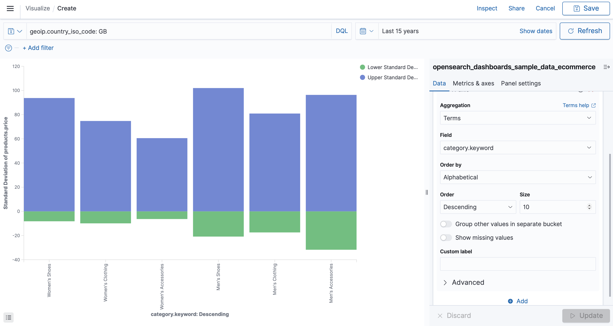

# To download docker image from [here](https://opensearch.org/docs/latest/opensearch/install/docker/#run-the-image)
docker-compose up -d


# To ensure everithing is done correctly

curl -XGET https://localhost:9200 -u 'admin:admin' --insecure

curl -XGET https://localhost:9200/_cat/nodes?v -u 'admin:admin' --insecure

curl -XGET https://localhost:9200/_cat/plugins?v -u 'admin:admin' --insecure

# To open OpenSearch Dashboards

http://localhost:5601

# Add data

# Answer questions below

## Data analytics task (Ecommerce data)

- Find top-10 most common first name of the customers from Birmingham


``` console
GET opensearch_dashboards_sample_data_ecommerce/_search
{
  "query": {
    "bool": {
      "filter": [
        {"term": {
          "geoip.city_name": "Birmingham"
        }}
      ]
    }
  }, 
  "aggs": {
    "user_agg": {
      "terms": {
        "field": "customer_first_name.keyword",
        "size": 10
        }
      }
    }
}
```

- # What is the busiest day for women buying products cheaper than 75$
- How many products were bought in the last 3 days from Great Britain?

``` console
GET opensearch_dashboards_sample_data_ecommerce/_search
{
  "size": 0,
  "query": { 
    "bool": { 
      "filter": [ 
        {"term": {"geoip.country_iso_code": "GB"}},
        {"range": {"order_date": {"gte": "now-3d/d","lt": "now/d"}}}
      ]
    }
  },
  "aggs": {"products_sum": { "sum": { "field": "products.quantity" } }
}
}
```

- Standard deviation visualisation of the price with ability to filter by country



``` console
GET opensearch_dashboards_sample_data_ecommerce/_search
{
  "size": 0,
  "query": { 
    "bool": { 
      "filter": [ 
        {"term": {"geoip.country_iso_code": "GB"}}
      ]
    }
  },
  "aggs": {
    "products_avg": {
      "terms": {"field": "category.keyword"},
      "aggs": {
      "type_agg": {
        "terms": {"field": "type"},          
        "aggs" : {
          "avg_price" : { "avg" : { "field" : "products.price" } }
         }
        }
       }
      }
    }
}
```

## Data analytics task (Flights data)

- Total distance in miles travelled by all flights

``` console
GET opensearch_dashboards_sample_data_flights/_search
{
  "size": 0,
  "aggs": {"total_distance": { "sum": { "field": "DistanceMiles" } }}
}
```

- Median price of the flight from Japan, US and Italy

``` console
GET opensearch_dashboards_sample_data_flights/_search
{
  "query": { 
        "terms" : { "OriginCountry" : ["IT", "US", "JP"]}
  },
  "aggs": {
    "median_distance": {
      "percentiles": {
        "field": "AvgTicketPrice",
        "percents": [50]
    }}
  }
}
```

- Top-10 most delayed destination airports

``` console
GET opensearch_dashboards_sample_data_flights/_search
{
  "size": 0,
  "aggs" : {
    "dest": {
      "terms": {
        "field": "DestAirportID",
        "size": 10,
        "order": { "max_delay_sum": "desc" }
      },
      "aggs": {"max_delay_sum" : { "sum" : { "field" : "FlightDelayMin" } }
    }
  }}
}
```

- Geo map visualisation based on the number of flights from and to the airport


## Data analytics task (Logs data)

- Top 5 tags in logs in which contains request to deliver css files
- What is sum of all RAM for Windows machines that have requests from 6am to 12pm
- Find total number of logs with IP in range from 176.0.0.0 to 179.255.255.254
